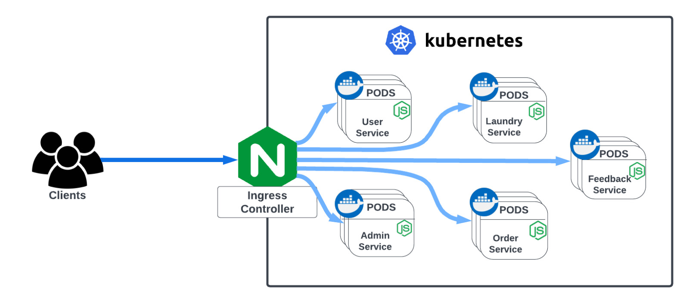

# e-Laundry

E-laundry, also known as electronic laundry, is a modern and innovative approach to laundry services
that leverages technology and the internet to offer convenient and efficient laundry solutions. It involves
the use of online platforms or mobile applications to connect customers with laundry service providers,
streamlining the process of getting laundry done.


## Technologies


## Architecture



## Installation
Install docker desktop and enable kubernetes  
Clone the repository
``` bash
git clone https://github.com/atanuc13/eLaundry.git
cd eLaundry
```

Install the dependencies and build docker images
``` bash
# ============== Admin Service ==============

cd adminService

# to install dependencies
npm install

# to build docker image
docker build -t admin .

cd ..
# ===========================================

# ============ Feedback Service =============

cd feedbackService

# to install dependencies
npm install

# to build docker image
docker build -t feedback .

cd ..
# ===========================================

# ============= Laundry Service =============

cd laundryService

# to install dependencies
npm install

# to build docker image
docker build -t laundry .

cd ..
# ===========================================

# ============== Order Service ==============

cd orderService

# to install dependencies
npm install

# to build docker image
docker build -t order .

cd ..
# ===========================================

# ============== User Service ==============

cd userService

# to install dependencies
npm install

# to build docker image
docker build -t user .

cd ..
# ===========================================
```  
Apply all the PODS for all the microservices and ingress gateway from the manifest files.

``` bash
cd infra/k8s
kubectl apply -f .
```

Go to host ip file and add the following entry

``` bash
127.0.0.1 elaundry.com
```  

## Evaluate

Import all the collection files from postman directory to excute all the REST api calls

## Contributors

<a href="https://github.com/atanuc13/eLaundry/graphs/contributors">
  
</a>
